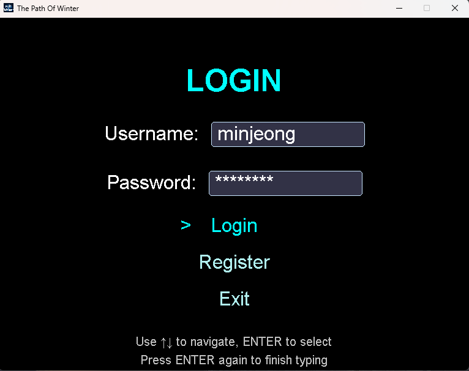
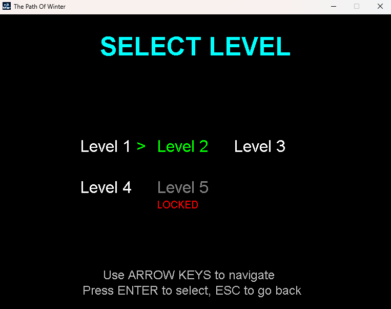
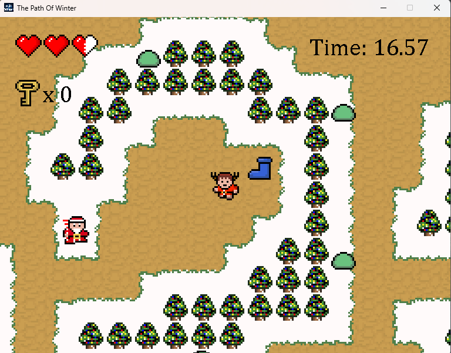
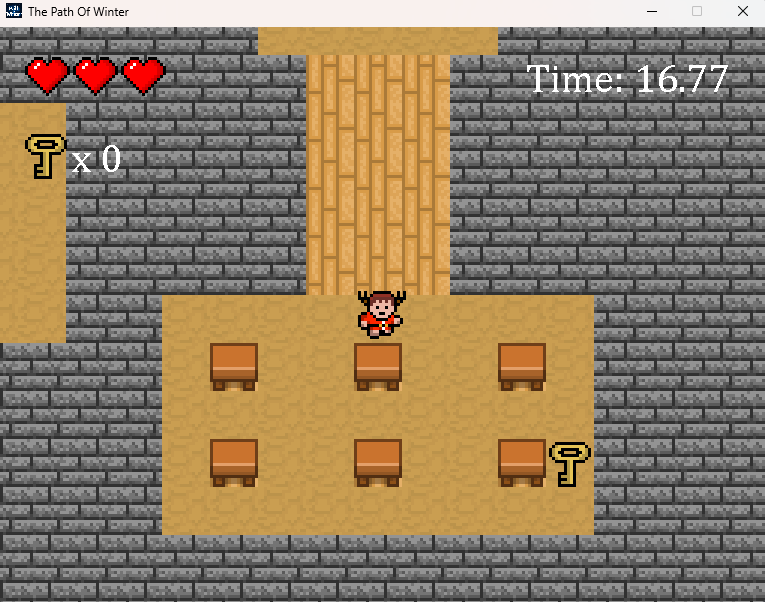

# ❄️ The Path of Winter

The Path of Winter is a 2D action-adventure game built in Java, designed around structured gameplay and object-oriented architecture.

---

## 📸 Preview

  
  

  
  

---

## 🚀 Overview

The project delivers a complete game system where players explore levels, interact with entities, and progress through structured challenges.

Built using Java and JavaFX, the system emphasizes Object-Oriented Programming (OOP) and a modular architecture.

---

## 🎮 Features

- Level-based progression system with persistent save data  
- Login & registration system using MySQL (JDBC)  
- Player combat, movement, and interaction system  
- AI-driven monsters with basic behavior and chasing logic  
- NPC interaction with dynamic dialogue  
- Inventory system (keys, items, progression objects)  
- Collision detection and event-based mechanics  
- Real-time rendering with smooth gameplay loop  

---

## 🧠 Architecture

- Object-Oriented Programming (OOP)  
- MVC-based design  
- Modular class structure  

---

## 🛠️ Tech Stack

Java • JavaFX • JDBC • MySQL  

---

## ⚡ Notes

This project demonstrates structured system design through a complete interactive application.
